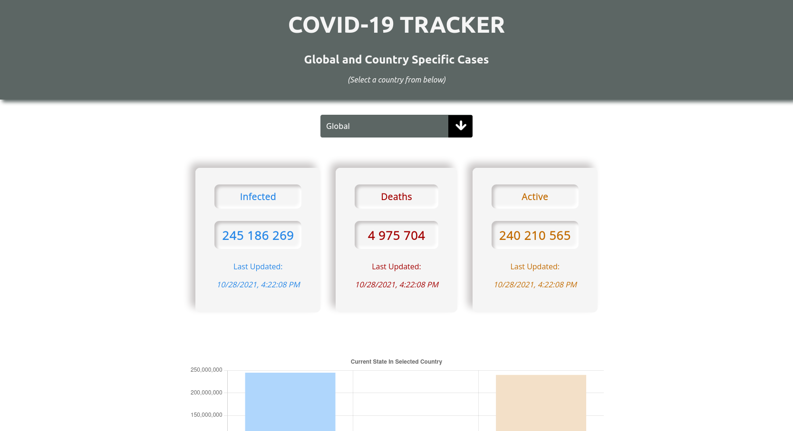

# Covid-19 Tracker App

## Tools

- ReactJS
- Redux
- Thunk
- ChartJS
- Mathdroid(Covid-19-Api)

## How to use

1. Clone the repo
2. install the dependencies with `npm install`
3. start the app with `yarn start`
